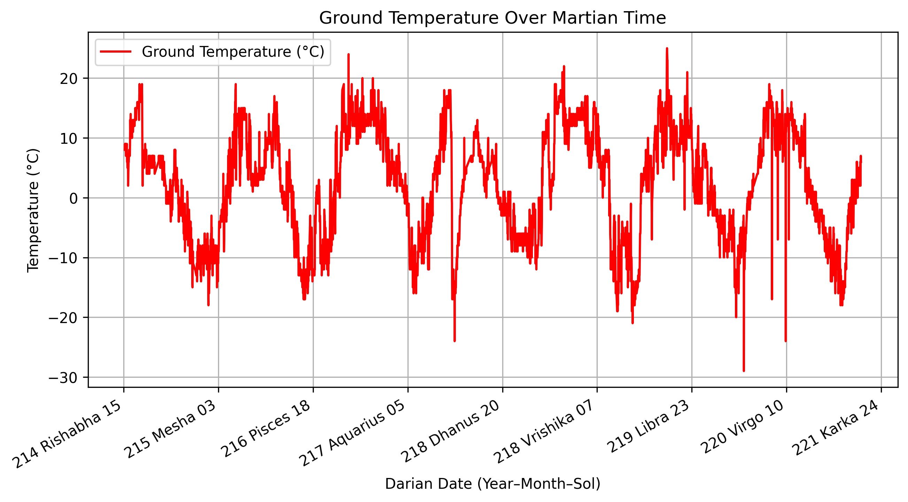

# mars-dtc: Integrated Mars Datetime and Calendar Support for Python.

[](https://pypi.org/project/mars-dtc/)



`mars-dtc` is a Python library for representing and manipulating Martian dates and times. 

This initial release implements the Darian calendar, which divides the Martian year into 24 months and accounts for leap sols. Future versions may include other proposed Martian calendar systems.

The library offers familiar functionality similar to Python’s `datetime` module. It integrates seamlessly with Pandas and Matplotlib, enabling analysis, visualization, and serialization of Martian temporal data.


## Installation

```bash
pip install mars-dtc
```


## Features

- Full implementation of the Darian calendar (24 months, 668–669 sols per year) in this initial relase.
- Core date and time classes:
  - `MarsDate` for calendar dates
  - `MarsDateTime` for date–time precision
  - `MarsTimedelta` for sol-based time deltas
- Arithmetic, comparisons, and rounding operations
- Serialization to and from JSON, YAML, and dictionaries
- Custom Pandas extension dtype for native column and Series support
- Integration with Matplotlib for native plotting
- Utilities for generating Martian date ranges and computing week or sol-of-year values

For the full set of features, see the [demo notebook](demo/demo.ipynb) included, showing:

- Basic date and time creation
- Arithmetic and formatting
- JSON/YAML serialization
- Pandas operations
- Plotting with Matplotlib

Alongside the demo, we include an example dataset of parsed Martian weather data with Darian calendar dates to allows users to test the package’s functionality.


## Citing mars-dtc

If you use `mars-dtc` in your publication, please cite it by using the following BibTeX entry.


```bibtex
@software{De_Lima_mars-dtc_Integrated_Mars_2025,
	author = {De Lima, Victor},
	month = oct,
	title = {{mars-dtc: Integrated Mars Datetime and Calendar Support for Python}},
	url = {https://purl.org/victordelima/mars-dtc},
	version = {0.1.1},
	year = {2025}
}
```